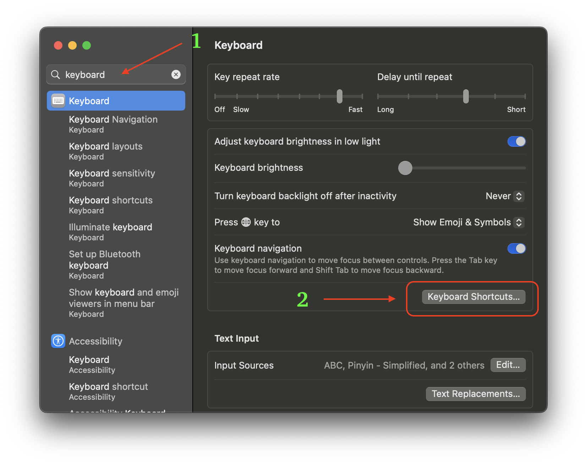
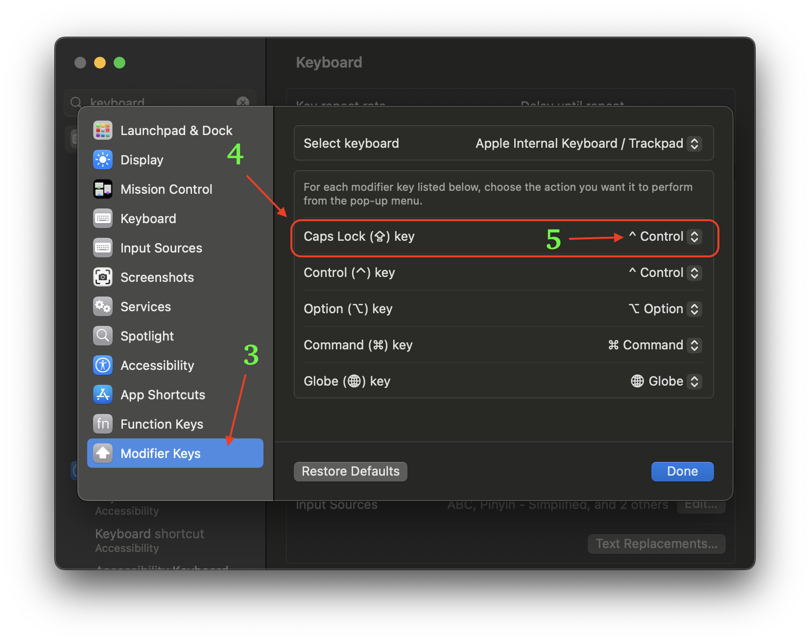
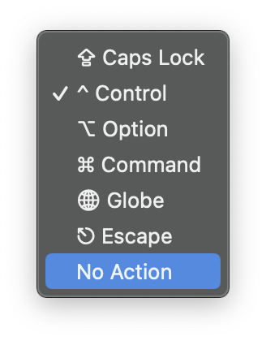
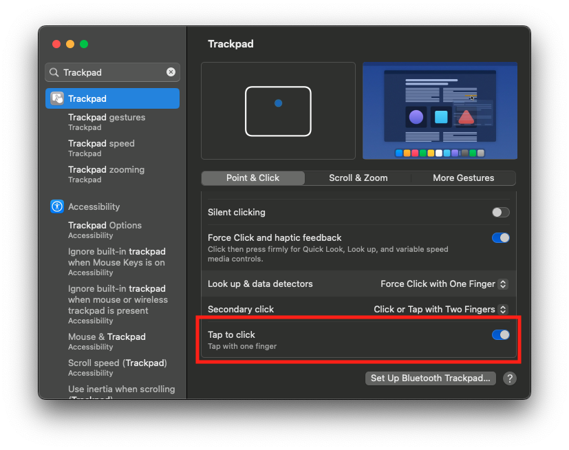
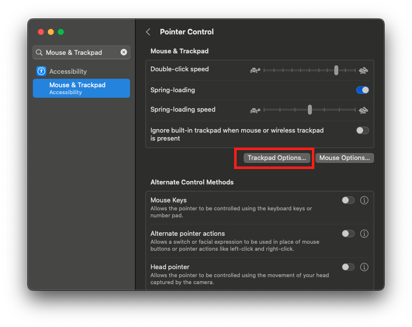
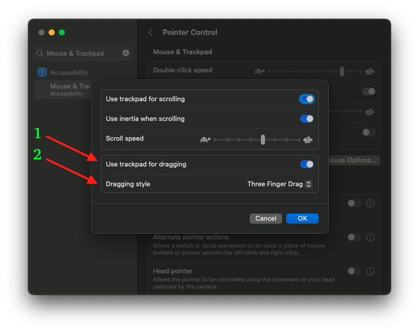

# 系统配置优化

## 1. 中/英切换键和 Ctrl 键交换

相对来说，使用 Mac 键盘上的中/英切换键来输入大写字符，与使用 `Shift` 辅助输入大写字符更麻烦，效率更低。

比如说，想要输入 `aBc` 这三个字符，使用中/英切换键输入大写字符，需要独立按 4 次按键（按键 `a`，中/英切换键，按键 `b`，按键 `c`）。

而如果使用 `Shift` 辅助输入大写字符，则只需要按 3 次键位（按键 `a`，按住 `Shift` 键的同时按键 `b`，按键 `c`）。

当然，在需要输入大量连续的大写字符时，使用中/英切换键可能会相对轻松。但在开发过程中，当遇到这种情况时，完全可以使用在线大小写工具来解决。

或者，如果你使用 `IdeaVim`（文本编辑工具，极大提高编辑文本时的效率），那大小写转换只需按几个快捷键就完成了。

### 1.1 修改方式
#### 使用系统设置App

  - 打开 `System Settings`，在搜索栏搜索 `keyboard`，如下图：
        
  - 点击上图红框处的 `Keyboard Shortcuts`，出现如下图的弹窗：
        
    - 单击选择左侧列表最下面的 `Modifier Keys` 选项
    - 然后，找到红框处，此处是对 `Caps Lock` 键位(也就是中/英切换键)的修改
    - 点击右侧的下拉框，出现一个小弹窗，如下图
      
    - 选择 `Ctrl` 键，最后点击 `Done` 完成。

### 1.2 有关 Vim 模式切换

如果你在日常的编码开发过程中，也是一个重度使用 `Vim` 工具的开发者，那么，相信你一定非常「厌烦」每次从插入模式切换回普通模式（Nomal Mode）都需要伸出手指按 Esc 键退出。

在将中/英切换键位改成 `Ctrl` 键之后，可以极大提升从其他模式切换回普通模式时的效率。

因为你可以改为使用 `Ctrl` + `[` 来完成不同模式之间的切换。（当然，这要求你可以熟练的用标准指法使用键盘。）

## 2. 触摸板优化

### 2.1 用轻点代替按压

在日常使用触摸板的过程中，会大量使用到单击的操作。如关闭一个网页、点开一个聊天框、选择菜单上的 item 等等。

Mac 系统默认的单击操作是在触控板上通过「单指按压」实现的。长期使用下来，会发现用来做按压的手指（我通常使用中指）变得非常疲劳，甚至产生轻微变形。

此时，可以调整系统设置：用轻点代替按压。

调整之后就只要轻轻的触碰触摸板，不用真的按压，就可以完成单击的操作，非常轻松。

#### 修改方式

有以下两种修改方式。

##### 1、用命令行的方式

```
defaults write com.apple.AppleMultitouchTrackpad Clicking -int 1
defaults -currentHost write NSGlobalDomain com.apple.mouse.tapBehavior -int 1
defaults write NSGlobalDomain com.apple.mouse.tapBehavior -int 1
```

##### 2、用系统设置App

- 打开 `System Settings`，在搜索栏搜索 `TrackPad`，如下图：
          
- 在上图红框中的 `Tap to click` 选项，选中打上勾即可。

### 2.2 开启三指拖移

在没有开启这个三指拖移功能之前，如果你想拖动窗口或者复制文本，都需要按压触控板然后拖移，才能移动窗口或者选中文本内容，整体操作起来不方便。

这时候，可以开启三指拖拽功能，这样的话：
- 当你想移动窗口位置时，只要将光标放到窗口顶部，然后用三个手指即可拖拽，而不用先点击选中窗口，再拖拽。
- 当你想选中一段文本时，直接将光标悬浮在想选中的文本上面，然后用三个手指拖拽光标，即可选择文本内容。

#### 修改方式

有以下两种修改方式。

#####  1、用命令行的方式
```
defaults write com.apple.driver.AppleBluetoothMultitouch.trackpad TrackpadThreeFingerDrag -bool true
defaults write com.apple.AppleMultitouchTrackpad TrackpadThreeFingerDrag -bool true
```

##### 2、用系统设置App

  - 打开 `System Settings`，在搜索栏搜索 `Mouse & TrackPad`，如下图：
        
  - 点击上图红框处的 `Trackpad Options`，出现如下图的弹窗：
        
      - 首先，将 `Use trackpad for dragging` 选项选中；
      - 然后，点击 `Dragging style` 右侧的下拉框，选中 `Three Finger Drag` ；
      - 最后，点击 `OK` 即可。

## 3. F1-F12 优化

默认情况下，Mac 键盘最上面一排的 F1-F12 键位都有其特殊的功能，比如 F1 和 F2 用来调节屏幕亮度，F5 和 F6 调节键盘灯亮度灯。

此时，它们的功能更偏向与娱乐，而不是普通的 F1-F12。但作为一个开发者，这些按键有更重要的作用。

在很多的 IDE 中提供的快捷键都需要 F1-F12，在断点调试时格外有用。

### 修改方式
